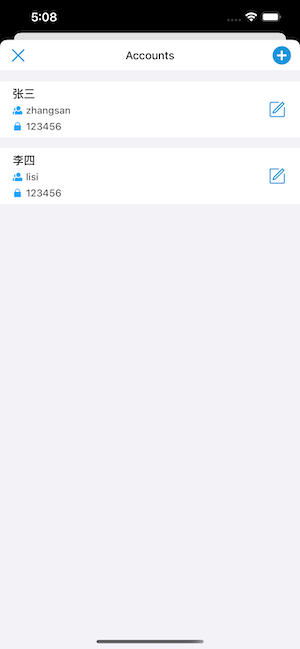

# XLAccountManager

[](https://travis-ci.org/xxl/XLAccountManager)
[](https://cocoapods.org/pods/XLAccountManager)
[](https://cocoapods.org/pods/XLAccountManager)
[](https://cocoapods.org/pods/XLAccountManager)

## Example



## Requirements

## Installation

XLAccountManager is available through [CocoaPods](https://cocoapods.org). To install
it, simply add the following line to your Podfile:

```ruby
pod 'XLAccountManager'
```

```Objective-C
#import <XLAccountManager/XLAccountManager.h>
XLAccountListController *vc = [[XLAccountListController alloc] init];
[self presentViewController:vc animated:YES completion:nil];
vc.selectedAccountCallback = ^(NSString * _Nonnull account, NSString * _Nonnull password) {
    NSLog(@"account: %@, password: %@", account, password);
};
```

## Author

mgfjx

## License

XLAccountManager is available under the MIT license. See the LICENSE file for more info.
